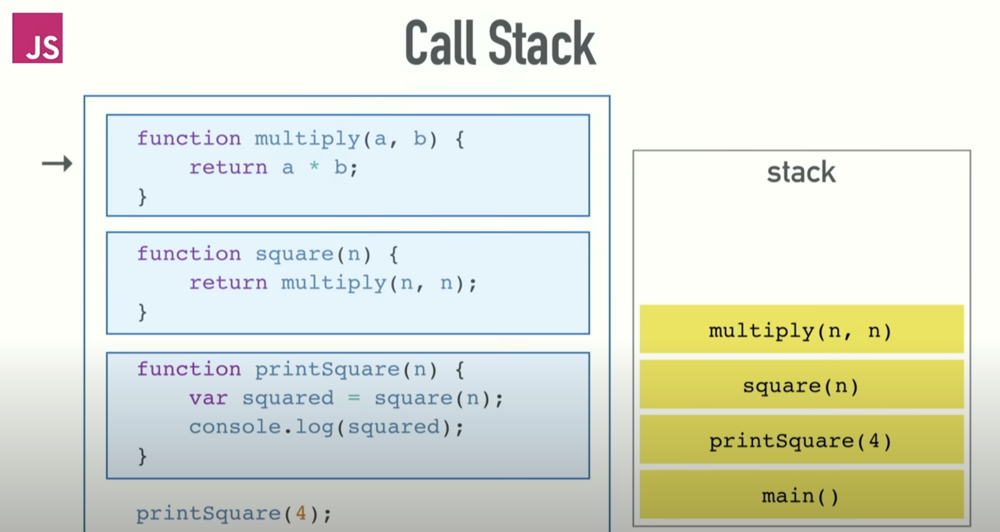

## Event Loop
避免單一任務執行時間過久，造成阻塞(blocking)
所以將任務分為，立即執行、稍後執行(Web APIs: 瀏覽器環境內提供的API, 所以當遇到這些API的時候, 這些API會在瀏覽器內執行, 而JavaScript 仍然可以繼續處理stack 內其他的task. 等到API 執行完後, 再將API內的callback function放到queue內等待處理)
    - call stack
    - task queue
    - macrotask
    - microtask

- single thread: 單執行緒或稱為單線程，意指一次只能執行一個任務
### call stack
    - records where we are in the program，我們程式執行到哪
    - #FILO
    - [從5'07開始看](https://youtu.be/8aGhZQkoFbQ?si=UNIQPA7tp18KWUGB&t=307)
    - 
### task queue 
    - 在webAPI執行後得到的結果會先放在queue，待stack清空後再執行queue
    - #FIFO

[Visualized Event Loop](http://latentflip.com/loupe/?code=JC5vbignYnV0dG9uJywgJ2NsaWNrJywgZnVuY3Rpb24gb25DbGljaygpIHsKICAgIHNldFRpbWVvdXQoZnVuY3Rpb24gdGltZXIoKSB7CiAgICAgICAgY29uc29sZS5sb2coJ1lvdSBjbGlja2VkIHRoZSBidXR0b24hJyk7ICAgIAogICAgfSwgMjAwMCk7Cn0pOwoKY29uc29sZS5sb2coIkhpISIpOwoKc2V0VGltZW91dChmdW5jdGlvbiB0aW1lb3V0KCkgewogICAgY29uc29sZS5sb2coIkNsaWNrIHRoZSBidXR0b24hIik7Cn0sIDUwMDApOwoKY29uc29sZS5sb2coIldlbGNvbWUgdG8gbG91cGUuIik7!!!PGJ1dHRvbj5DbGljayBtZSE8L2J1dHRvbj4%3D)

皆為非同步任務

### microtask
- 當前執行上下文(execution context) ，會立即執行的任務
    - Promise.then()
    - process.nextTick(node.js)


### macrotask
- 當前執行上下文結束後才執行的任務
    - setTimeOut
    - DOM event
    - script引入
    - I/O


#### 執行順序
1. call stack中所有"同步"執行的程式碼
2. call stack中所有的mircrotasks
3. 渲染DOM
4. 執行macrotasks


範例程式1
```
console.log('start');

setTimeout(() => {
  console.log('setTimeout');
});

Promise.resolve().then(() => {
  console.log('Promise');
});

console.log('end');

/*
執行結果:
start
end
Promise
setTimeout
*/
```

範例程式2
```
setTimeout(() => alert("timeout"));

Promise.resolve()
  .then(() => alert("promise"));

alert("global ex. context");
```
這段程式碼剛好同時用到 Web API 與 Promise ，各自在呼叫後會產生一個 Macrotask 以及 Microtask ，不過在順序上是哪個會先被執行呢？稍微分析一下：

- 所有的 Queue 都會等待執行環境堆疊被清空，alert 肯定會先執行
- setTimeout 對應的函式會被當作一個 Macrotask ，等待時間到之後被送入 Macrotask Queue
- Promise 對應的 .then 或 .catch 的函式會被當作一個 Microtask 送入 Microtask Ｑueue
- 在執行環境堆疊清空之後，通常網頁會先做一次 Render，Render 的動作同時也算是一個 Macrotask

因此推測 alert 的順序應該會像是這樣：

1. "global ex. contenxt"
2. "timeout"
3. "promise"
但是並不是！結果會是 "promise" 比 "timeout" 還要更先被 log 出來：

1. "global ex. contenxt"
2. "promise"
3. "timeout"
這是為什麼呢？這邊可能會有點抽象，前面我們在分析 JS 語法與運作模式的時候，大多是從 JS 引擎的角度出發。而前面也有提到， Queue 的概念並不屬於 JS 引擎的一部分，相對的歸屬於瀏覽器。對於瀏覽器來說，在網頁頁面開啟時，載入對應的 JS 檔並且執行這件事情，也是一個 Macrotask 。

而剛剛提到 Macrotask 執行完畢後，會優先執行 Microtask ，因此你會看到 "promise" 出現的順序先於 "timeout" 。

references:
1. https://gcdeng.com/series/Javascript/javascript-deep-dive-into-event-loop#javascript-engine
2. https://medium.com/when-you-feel-like-quitting-think-about-why-you/javascript-17-%E4%BD%87%E5%88%97-queue-578ce8b5a174

1. [JS 原力覺醒 Day15 - Macrotask 與 MicroTask](https://ithelp.ithome.com.tw/articles/10222737)
2. [深入研究並解釋Event Loop](https://ceall8650.medium.com/%E7%AD%86%E8%A8%98-event-loop-%E8%87%AA%E5%95%8F%E8%87%AA%E7%AD%94%E7%AD%86%E8%A8%98-373b8c632836)
3. [我知道你懂 Event Loop，但你了解到多深？](https://yeefun.github.io/event-loop-in-depth/)
4. [請說明瀏覽器中的事件循環 (Event Loop)](https://www.explainthis.io/zh-hant/swe/what-is-event-loop)
5. [最常見的事件循環 (Event Loop) 面試題目彙整](https://www.explainthis.io/zh-hant/swe/js-event-loop-questions)